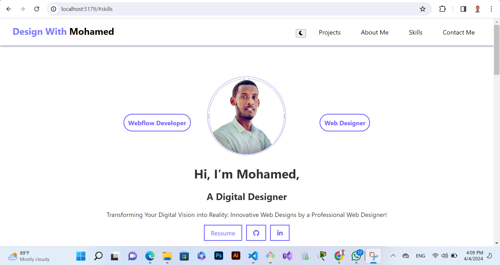

# Project Title: React Portfolio

## Project Overview

Welcome to my React portfolio! This is a dynamic web application that showcases my skills and projects as a Webflow Developer and Web Designer.



## Features

- **Responsive Design**: Adapts to screen size for mobile, tablet, and desktop devices.
- **Interactive Tags**: Skill tags such as "Webflow Developer" and "Web Designer" highlight Mohamed's key skills.
- **Navigation Menu**: A collapsible navigation menu for easy access to different sections of the portfolio.

## About The Project

I've designed this portfolio to be a reflection of my work and ethos as a digital designer. It's built with the latest web technologies to ensure a seamless and engaging user experience.

### Built With

- [React](https://reactjs.org/)
- [Bootstrap](https://getbootstrap.com)
- [Font Awesome](https://fontawesome.com)

## Getting Started

To get a local copy up and running, follow these simple steps.

### Prerequisites

- npm
  ```sh
  npm install npm@latest -g

## Installation
1. Clone the repo
    ```sh
    git clone https://github.com/your-username/react-portfolio.git
2. Install NPM packages
    ```sh
    npm install


### Usage
This portfolio is a great starting point for understanding my capabilities as a developer and designer. You can view the live projects, read about my design process, and see the technologies I use.

### Roadmap
For future updates and project progression, check out the issues page.

### Contributing
Contributions are what make the open source community such an incredible place to learn, inspire, and create. Any contributions you make are greatly appreciated.


## Contact

Mohamed - [ibnuali600@gmail.com]

Project Link: [live](https://github.com/IbnuAlii/REACT/tree/main/ASSIGNMENTS)

## Acknowledgements

- [React](https://reactjs.org/)

